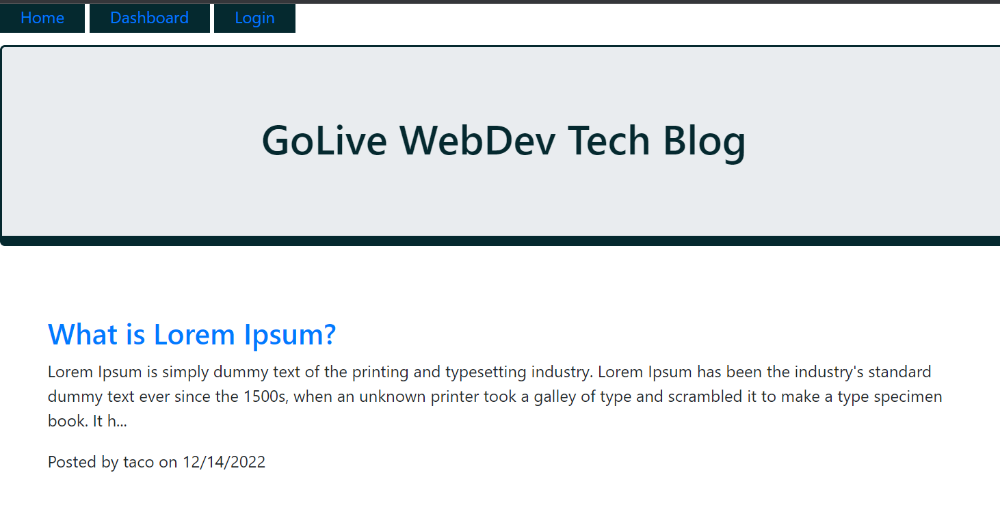

# MVC-Tech-Blog

## Table of Contents 
- [Application Image](#application-image)
- [Instructions](#instructions--usage)
- [Usage Video](#usage-video)
- [License](#license)
- [Questions](#questions)

## Application Image 

## Instructions
Once on the website, the visiting developer can read blog posts other developers have written.  If the visitor wishes to post an article or comment on someone elses article, they must either create a login account or login using a previously created username and password.  Once logged in, the visitor can click on the title of an article to make a comment.  The visitor can also go into their dashboard to add a post, edit a previously written post or delete a post they have submitted.  The visitor can logout by clicking on the logout button or if they have not been active for 5 mintues, the system will log them out automatically.

## Usage Video
An example of how it works can be viewed here: 

## License 
A short, permissive software license. Basically, you can do whatever you want as long as you include the original copyright and license notice in any copy of the software/source.  There are many variations of this license in use.

## Questions
If you would like to contribute or you simply have questions, please visit: 

https://github.com/MicheleTornetta

or email me at:
mlt@pwahsolutions.com

## Website
https://pacific-depths-98854.herokuapp.com/
